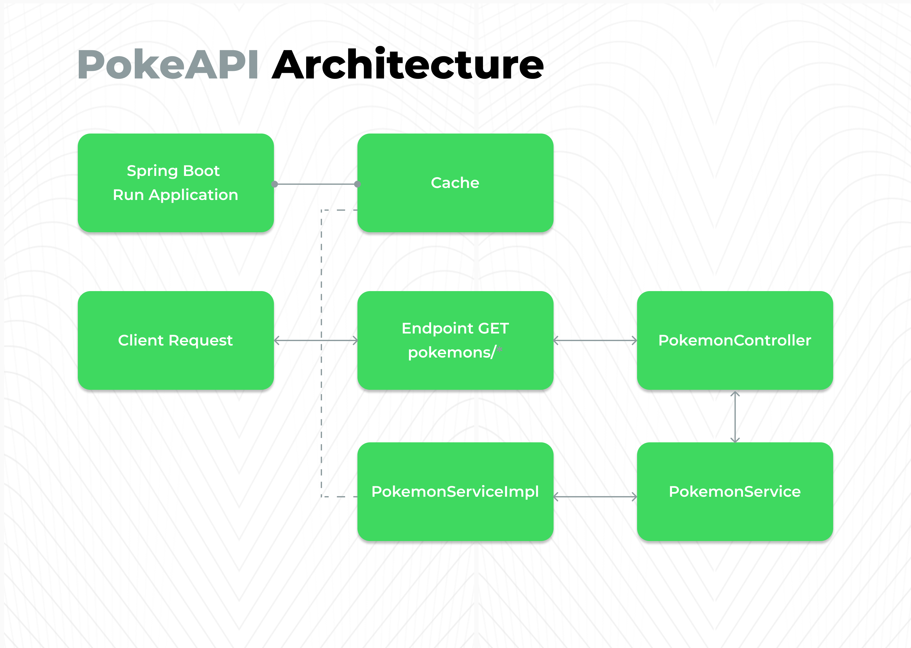

# PokéAPI Microservice

This is a microservice that consumes the PokéAPI to provide a list of Pokémon based on parameters such as query, to search by name (or part of it) and ordering.

The sorting in this microservice is done manually, and can be alphabetical or by size, using the Quick Sort algorithm.

The service was developed using Java with Spring Boot and Gradle, with the goal of offering a simple and efficient API for querying Pokémon data.

## Table of Contents
- [Architecture](#architecture)
- [Features](#features)
- [Quick Sort Algorithm](#quick-sort-algorithm)
- [Improvements](#improvements-points)
- [Execution Instructions](#execution-instructions)

## Architecture
The microservice was developed using Spring Boot in Java, taking advantage of its flexibility and speed for building microservices.

Communication with the PokéAPI is done via simple HTTP calls, using a manual cache to make requests with WebClient as soon as the application is started.

The microservice architecture is simple and straightforward, with the business logic separated into layers to facilitate management and scalability.



## Technologies Used:

- **Spring Boot (Java)**

- **Gradle**

- **PokéAPI**

- **Docker**

## Features

### Parameters

| Parameter | Type | Optional | Values ​​|
|--------|------------------------------------------|-----------------------------|--------------------------------------------------|
| query | `String` | Yes | If not specified, returns a list with all Pokémon |
| sort | `String` | Yes | `ALFHABETICHAL` or `LENGTH` |

### Endpoints

<details>
<summary>Pokémon Query</summary>

Displays the list of Pokémon available in the API, allowing filtering by name and sorting.

`GET /pokemons`
#### Response
```json
{
   "result": [
      "pidgey",
      "pidgeotto",
      "pidgeot"
   ]
}
```
</details>

<details>
<summary>Pokémon Search with Highlight</summary>

List of Pokémon with the searched part highlighted, allowing the application of filters and sorting

`GET /pokemons/highlight`
#### Response
```json
{
  "result": [
    {
        "name": "pichu",
        "highlight": "<pre>pi</pre>chu"
    },
    {
        "name": "pikachu",
        "highlight": "<pre>pi</pre>kachu"
    }
  ]
}
```
</details>

## Quick Sort Algorithm
<details>
<summary>Complexity Big(O)</summary>

The most logical implementation of this algorithm is documented in the **JAVADOC** of this code, in *com.looqbox.util.QuickSort*.

The algorithm chosen to solve this challenge was Quick Sort, due to its efficiency in sorting large lists, with an average complexity of `O(n log n)`, being fast and suitable for processing large volumes of data.

Compared to Merge Sort, its main advantage is in the direct partitioning of the list, avoiding the use of significant extra memory.

Its complexity in the average case is `O(n log n)`, since the algorithm performs `log n` divisions, each one processing n elements.

The sequence of divisions follows a logarithmic growth, which justifies the depth of the recursion tree being proportional to `log n`, resulting in the efficiency of the method.

</details>

## Points to Improve
<details>
<summary>Bottlenecks</summary>

In developing this challenge, we sought to ensure clean, maintainable and scalable code.

However, some improvements can be implemented, as well as the identification of possible bottlenecks that the application may face:

### Manual Cache Optimization

- The current implementation of manual caching can be improved as demand and resource consumption of the API increases.
- If the manual caching approach is maintained, the introduction of a Scheduler would be an interesting alternative, allowing periodic and automatic updating of the cache, ensuring that the stored data is always up to date without the need for manual intervention.

### Adjustments to the ResponseDTO Structure

- ResponseDTO was created to avoid duplication of classes by returning lists of similar objects.
- As the application grows and new services follow this same pattern – only varying the list type (such as String and Pokemon) – the use of a generic DTO becomes a more scalable solution.
- With this approach, the DTO could be reused in different scenarios, making the code more flexible and reducing the need to create multiple specific classes for each type of response.

Despite this, the API follows design patterns, such as Singleton in the cache implementation and Strategy in the service structure, ensuring greater efficiency, flexibility and code maintenance.

</details>

## Execution instructions

**Prerequisites**
- JDK 17 or higher
- Gradle
- Docker

### Clone the repository
```git
https://github.com/maviifreitass/challenge.git
```

### Access the project folder
```git
cd challenge-main
```

### Running Locally without Docker
```git
gradle build
```

```git
gradle run
```

### Running Locally with Docker

#### Build the Docker Image
```git
docker build -t pokeapi-challenge .
```
#### Run the Container
```git
docker run -p 8080:8080 pokeapi-challenge
```
